# 🚀 Simple DSA - Hacktoberfest 2025

<div align="center">


**A beginner-friendly collection of Data Structures and Algorithms problems**

Perfect for first-time contributors and Hacktoberfest 2025 participants

[Getting Started](#-getting-started) •
[Contributing](#-how-to-contribute) •
[Guidelines](CONTRIBUTING.md) •
[Code of Conduct](CODE_OF_CONDUCT.md) •
[License](LICENSE)

</div>

---

## 📖 About

**Simple DSA** is an open-source repository designed to help developers master fundamental programming concepts through hands-on practice. This project welcomes contributions in **any programming language** and provides a structured pathway for learning Data Structures and Algorithms.

### 🎯 Project Vision

- 📚 Build a comprehensive, multi-language DSA problem collection
- 🌍 Foster an inclusive learning community for developers of all levels
- 🤝 Provide meaningful contribution opportunities for Hacktoberfest
- 🎓 Bridge the gap between theory and practical implementation
- 🏆 Maintain high code quality standards and best practices

### ✨ Why This Repository?

<table>
<tr>
<td align="center">

<br><b>Multi-Language</b>
<br>Solve in your preferred language
</td>
<td align="center">

<br><b>Educational</b>
<br>Learn by doing
</td>
<td align="center">

<br><b>Community Driven</b>
<br>Collaborate and grow
</td>
<td align="center">

<br><b>Recognition</b>
<br>Get credited for contributions
</td>
</tr>
</table>

---

## 📊 Project Statistics

<div align="center">

| 📈 Metric | 🔢 Count |
|-----------|----------|
| **Total Problems** | 200+ |
| **Categories** | 10+ |
| **Supported Languages** | Any |
| **Contributors** | [See contributors.json](contributors.json) |

</div>

---

## 🗂️ Problem Categories

Our problems are organized into **comprehensive categories** covering all major DSA topics:

```
📁 Categories
│
├── 🟢 Basic Programming & Arithmetic
│   └── Fundamental operations and syntax
│
├── 🟡 Control Flow & Decision Making
│   └── Conditionals and logical operations
│
├── 🟠 Loops, Functions & Recursion
│   └── Iteration, function design, and recursive thinking
│
├── 🔵 Arrays & Matrices
│   └── Array manipulation and matrix operations
│
├── 🟣 Strings & Pattern Matching
│   └── String processing and algorithms
│
├── 🔴 Searching & Sorting
│   └── Classic search and sort algorithms
│
├── 🟤 Linked Lists
│   └── Single, double, and circular linked lists
│
├── ⚫ Trees & Graphs
│   └── Binary trees, BST, graphs, and traversals
│
├── 🟥 Dynamic Programming
│   └── Memoization and tabulation techniques
│
└── 🟦 Advanced Data Structures
    └── Heaps, tries, segment trees, and more
```

> **📝 Note:** Complete problem descriptions with LeetCode integration are available in [PROBLEM_LIST.md](PROBLEM_LIST.md)

---

## 🚀 Getting Started

### Quick Setup

```bash
# 1. Fork and star this repository ⭐

# 2. Clone your fork
git clone https://github.com/YOUR_USERNAME/Simple-DSA.git

# 3. Navigate to the directory
cd Simple-DSA

# 4. Check available problems
# Browse PROBLEM_LIST.md to select a problem

# 5. Create an issue for the problem you want to solve
# Wait for assignment before starting work
```

### 📋 Prerequisites

- Git installed ([Download](https://git-scm.com/downloads))
- GitHub account ([Sign up](https://github.com/join))
- Code editor (VS Code, IntelliJ, etc.)
- Language compiler/interpreter
- **[Optional]** Hacktoberfest registration ([Register](https://hacktoberfest.com))

---

## 💻 How to Contribute

### Contribution Workflow

```mermaid
graph LR
    A[Browse PROBLEM_LIST.md] --> B[Create Issue]
    B --> C[Wait for Assignment]
    C --> D[Create Branch]
    D --> E[Write Solution]
    E --> F[Test Code]
    F --> G[Update contributors.json]
    G --> H[Commit Changes]
    H --> I[Push to Fork]
    I --> J[Create Pull Request]
    J --> K[Code Review]
    K --> L[Merge]
```



### Step-by-Step Guide

<details>
<summary><b>1️⃣ Browse Available Problems</b></summary>

- Check [PROBLEM_LIST.md](PROBLEM_LIST.md) for the complete problem catalog
- Problems are organized by difficulty and topic
- Each problem includes description, constraints, and examples
- LeetCode problems are linked for reference

</details>

<details>
<summary><b>2️⃣ Create an Issue</b></summary>

**⚠️ IMPORTANT: You must create an issue and wait for assignment before starting work!**

- Go to the [Issues](../../issues) tab
- Click "New Issue" and select "Solution Submission"
- Fill in the template:
  ```
  Problem: Q[number] - [Problem Name]
  Language: [Your chosen language]
  Description: Brief description of your approach
  ```
- Wait for a maintainer to assign the issue to you
- **Do not start coding until assigned!**

</details>

<details>
<summary><b>3️⃣ Set Up Your Development Environment</b></summary>

**Only after assignment:**

```bash
# Create and switch to a new branch
git checkout -b add-solution-q15-python

# Ensure you're on the latest version
git pull origin main
```

</details>

<details>
<summary><b>4️⃣ Write Your Solution</b></summary>

- Follow the [file structure guidelines](REPOSITORY_STRUCTURE.md)
- Use proper naming conventions: `q[number]_description.ext`
- Add meaningful comments explaining your approach
- Include time and space complexity analysis

**Example Structure:**
```
Language/
└── q15_leap_year.py
```

</details>

<details>
<summary><b>5️⃣ Update contributors.json</b></summary>

Add your information to the `contributors.json` file:

```json
{
  "name": "Your Name",
  "github": "your-username",
  "contributions": ["Q15 - Python"],
  "profile_url": "https://github.com/your-username"
}
```

</details>

<details>
<summary><b>6️⃣ Commit and Push</b></summary>

```bash
# Stage your changes
git add .

# Commit with a meaningful message
git commit -m "feat: Add solution for Q15 in Python"

# Push to your fork
git push origin add-solution-q15-python
```

</details>

<details>
<summary><b>7️⃣ Create a Pull Request</b></summary>

- Go to your fork on GitHub
- Click "Compare & pull request"
- Fill out the PR template completely
- **Link the issue you created** using "Closes #issue-number"
- Wait for review and feedback

</details>

> **💡 Pro Tip:** Read our [CONTRIBUTING.md](CONTRIBUTING.md) for detailed guidelines!

---

## 📜 Contribution Guidelines

### ✅ We Accept

- ✔️ Solutions for assigned issues only
- ✔️ Well-tested, working solutions
- ✔️ Solutions in any programming language
- ✔️ Clean, documented code with comments
- ✔️ One solution per pull request
- ✔️ Meaningful variable and function names

### ❌ We Reject

- ✖️ PRs without a linked issue
- ✖️ Solutions for unassigned problems
- ✖️ Plagiarized or copied code
- ✖️ Duplicate solutions in the same language
- ✖️ Untested or broken code
- ✖️ PRs without proper documentation
- ✖️ Spam or low-effort contributions

### 📏 Code Standards

All contributions must follow our quality standards:

- **Issue Requirement**: Must have an assigned issue before PR
- **Code Quality**: Clean, readable, and well-structured
- **Documentation**: Include comments and complexity analysis
- **Testing**: Thoroughly tested with multiple test cases
- **Naming**: Follow language-specific conventions
- **Structure**: Adhere to repository organization

See [CONTRIBUTING.md](CONTRIBUTING.md) for complete guidelines.

---

## 🏗️ Repository Structure

```
Simple-DSA/
├── 📄 README.md
├── 📄 PROBLEM_LIST.md
├── 📄 LICENSE
├── 📄 CODE_OF_CONDUCT.md
├── 📄 CONTRIBUTING.md
├── 📄 SECURITY.md
├── 📄 REPOSITORY_STRUCTURE.md
├── 📊 contributors.json
│
├── 📁 .github/
│   ├── ISSUE_TEMPLATE/
│   │   ├── bug_report.md
│   │   ├── feature_request.md
│   │   └── solution_submission.md
│   └── pull_request_template.md
│
├── 📁 C/
├── 📁 C++/
├── 📁 Java/
├── 📁 Python/
├── 📁 JavaScript/
└── 📁 [Your Language]/
```

See [REPOSITORY_STRUCTURE.md](REPOSITORY_STRUCTURE.md) for detailed organization.

---

## 🤝 Community

### Code of Conduct

We are committed to providing a welcoming and inclusive environment. Please read our [Code of Conduct](CODE_OF_CONDUCT.md) before participating.

### Getting Help

- 📖 Read the [Contributing Guidelines](CONTRIBUTING.md)
- 🐛 Report bugs using [issue templates](.github/ISSUE_TEMPLATE/bug_report.md)
- 💡 Suggest features via [feature requests](.github/ISSUE_TEMPLATE/feature_request.md)
- 💬 Join discussions in the Issues section

### Recognition

All contributors are recognized in:
- 📝 [contributors.json](contributors.json)
- 🏆 Repository contributors page
- 🌟 Special mentions for outstanding contributions

---

## 📊 Progress Tracking

Check your Hacktoberfest progress:

- **Hacktoberfest Dashboard**: [hacktoberfest.com/profile](https://hacktoberfest.com/profile)
- **Valid Contributions**: PRs must be merged or approved
- **Spam Policy**: Low-quality PRs will be marked as invalid

---

## 📄 License

This project is licensed under the **MIT License** - see the [LICENSE](LICENSE) file for details.

```
MIT License - Copyright (c) 2025 Simple DSA Contributors
```

---

## 🌟 Star History

[](https://star-history.com/#OWNER/Simple-DSA&Date)

---

## 👥 Project Leadership & Architecture

<div align="center">

<table>
<tr>
<td align="center" width="50%">

<br>
<h3>🏗️ Core Project Architect</h3>
<h2><b>Ayush Sharma</b></h2>
<p><i>@ayushHardeniya</i></p>
<p><b>Repository Curator & Documenter</b></p>

[](https://www.linkedin.com/in/ayush-hardeniya/)
[](https://github.com/ayushHardeniya)
[](https://twitter.com/ayush_hardeniya)

<details>
<summary><b>📋 View Detailed Contributions</b></summary>
<br>
<table border ="1">
<tr><td><b>📐 Documentation & Design</b></td></tr>
<tr><td>✅ Complete repository structure & organization</td></tr>
<tr><td>✅ Comprehensive problem catalog (200+ problems)</td></tr>
<tr><td>✅ LeetCode integration & curated sheets mapping</td></tr>
<tr><td>✅ Redesigned README.md with modern layout</td></tr>
<tr><td>✅ Complete PROBLEM_LIST.md documentation</td></tr>
<tr><td>✅ Contribution guidelines & workflow templates</td></tr>
<tr><td>✅ File naming conventions & repository standards</td></tr>
<tr><td>✅ Community management & issue templates</td></tr>
<tr><td>&nbsp;</td></tr>
<tr><td><b>💻 Code Contributions</b></td></tr>
<tr><td>✅ Multiple C++ solutions (1838.cpp, 118.cpp)</td></tr>
<tr><td>✅ Advanced problems (Minimize_the_heights.cpp)</td></tr>
<tr><td>✅ LeetCode problems (119.cpp and many more)</td></tr>
<tr><td>✅ Well-documented code with complexity analysis</td></tr>
</table>
</details>

</td>
<td>        </td>
<td align="center" width="50%">

<br>
<h3>👨‍💼 Project Admin</h3>
<h2><b>Noodles Sed</b></h2>
<p><i>@noodles-sed</i></p>
<p><b>Repository Maintainer & Admin</b></p>

[](https://github.com/noodles-sed)


<details>
<summary><b>📋 View Responsibilities</b></summary>
<br>
<table border = "1">
<tr><td>✅ Repository administration & management</td></tr>
<tr><td>✅ Pull request reviews & approvals</td></tr>
<tr><td>✅ Issue triage & assignment</td></tr>
<tr><td>✅ Community moderation & support</td></tr>
<tr><td>✅ Maintaining code quality standards</td></tr>
<tr><td>✅ Project oversight & coordination</td></tr>
<tr><td>✅ Contributor engagement & recognition</td></tr>
</table>
</details>

</td>
</tr>
</table>

</div>

---

## 🙏 Acknowledgments

Special thanks to:

- 🎃 **Hacktoberfest** for promoting open-source contributions
- 👥 **All Contributors** for their valuable solutions
- 🌍 **Open Source Community** for continuous support
- 📚 **LeetCode** for problem inspiration and references
- 🎯 **Striver, NeetCode, and other educators** for curated DSA sheets

---

<div align="center">

### 🚀 Ready to Contribute?

**[Fork this Repository](https://github.com/OWNER/Simple-DSA/fork)** | **[View Problems](PROBLEM_LIST.md)** | **[Create Issue](../../issues/new/choose)**

---

### Show Your Support

If you find this project helpful, please consider:

⭐ **Starring** this repository | 🍴 **Forking** for your contributions | 📢 **Sharing** with others

---

**Project Admin - [noodles-sed](https://github.com/noodles-sed)**

**This Repository is Documented & Structurized with ❤️ by [Ayush Hardeniya](https://github.com/ayushHardeniya)** 

**Happy Coding! 💻✨**

</div>